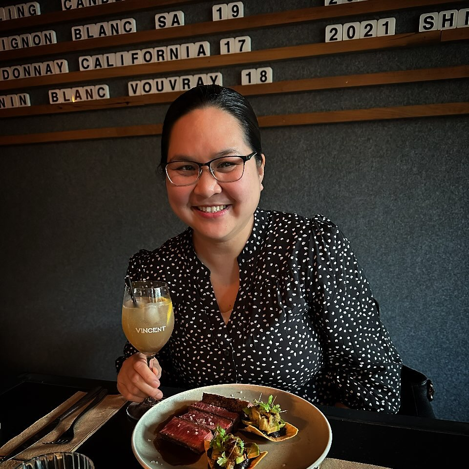

# **Kate Mendoza** 

[Home](#home) | [About](#about) | [Skills](#skills) | [Project](#project) | [Contact](#contact)

## Developer. Physician. Phlebotomist. Wife. Mother.

 
[LinkedIn](www.LinkedIn.com) | [GitHub](www.GitHub.com) | [Facebook](www.facebook.com) | [Instagram](www.instagram.com) | [email](kate@yahoo.com)

&copy; 2025 Kate Mendoza. All rights reserved.

# **Kate Mendoza**

[Home](#home) | [About](#about) | [Skills](#skills) | [Project](#project) | [Contact](#contact)

I am passionate in developing new skills and excited to apply it in medical practice. 
 
[LinkedIn](www.LinkedIn.com) | [GitHub](www.GitHub.com) | [Facebook](www.facebook.com) | [Instagram](www.instagram.com) | [email](kate@yahoo.com)

&copy; 2025 Kate Mendoza. All rights reserved.

[Home](#home) | [About](#about) | [Skills](#skills) | [Project](#project) | [Contact](#contact)

# **Skills**

 
[LinkedIn](www.LinkedIn.com) | [GitHub](www.GitHub.com) | [Facebook](www.facebook.com) | [Instagram](www.instagram.com) | [email](kate@yahoo.com)

&copy; 2025 Kate Mendoza. All rights reserved.

[Home](#home) | [About](#about) | [Skills](#skills) | [Project](#project) | [Contact](#contact)

# **Projects**

### First Project
1) Detailed description of my first project

 
### Second Project
2) Detailed description of my second project

### Third Project
1) Detailed description of my third project

[LinkedIn](www.LinkedIn.com) | [GitHub](www.GitHub.com) | [Facebook](www.facebook.com) | [Instagram](www.instagram.com) | [email](kate@yahoo.com)

&copy; 2025 Kate Mendoza. All rights reserved.

[Home](#home) | [About](#about) | [Skills](#skills) | [Project](#project) | [Contact](#contact)

# **Get in Touch**

Name: 

Email:

Message:

  <button>Send email</button>

 
[LinkedIn](www.LinkedIn.com) | [GitHub](www.GitHub.com) | [Facebook](www.facebook.com) | [Instagram](www.instagram.com) | [email](kate@yahoo.com)

&copy; 2025 Kate Mendoza. All rights reserved.

